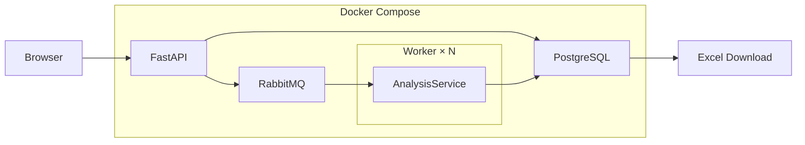

# 1 Сервис "Vitrage Analyzer" для анализа проектной документации по витражным конструкциям 

## 1.1 Описание сервиса
Vitrage Analyzer — веб-приложение для автоматического анализа проектной документации витражных конструкций. Система определяет расположение конструкций на чертежах, извлекает их параметры с использованием моделей компьютерного зрения, осуществляет запись в базу данных и формирует итоговую таблицу в формате Excel.

## 1.2 Возможности

- регистрация и авторизация пользователей;
- загрузка проектной документации в формате PDF;
- выбор анализируемых страниц;
- асинхронная обработка документов;
- детекция чертежей с помощью нейросетевой модели YOLO;
- извлечение габаритных размеров, количества, наименования и количества дверей для каждого чертежа;
- хранение результатов в PostgreSQL;
- экспорт результатов в Excel.

## 1.3 Архитектура



Приложение построено по сервисной архитектуре и состоит из нескольких независимых компонентов.

Пользователь взаимодействует с веб-интерфейсом, реализованным на FastAPI. После загрузки документа информация о нём сохраняется в базе данных PostgreSQL, а задача анализа помещается в очередь RabbitMQ.

Фоновые процессы (Workers) получают задания из очереди и независимо выполняют обработку документов. Каждый воркер загружает модели машинного зрения только один раз при запуске, что позволяет эффективно использовать вычислительные ресурсы и масштабировать систему без изменения программного кода.

Результаты анализа сохраняются в PostgreSQL. Веб-приложение отображает их в виде единой таблицы и предоставляет возможность сформировать Excel-документ непосредственно на основе данных базы данных.

# 2 Запуск сервиса

## 2.1 Клонирование репозитория

```bash
git clone https://github.com/TimofeyKhramov/Vitrage_analyzer_MFDP.git
cd vitrage-analyzer
```

## 2.2 Создание файла окружения

Создайте файл `.env` на основе примера:

```bash
cp .env.example .env
```

При необходимости измените параметры подключения к базе данных, RabbitMQ и другим сервисам.

## 2.3 Запуск приложения

```bash
docker compose up --build
```

После запуска будут доступны:

- API — http://localhost:8000
- RabbitMQ Management — http://localhost:15672

## 2.4 Масштабирование обработки

Обработка документов полностью отделена от пользовательского интерфейса. Благодаря использованию RabbitMQ возможно запускать несколько экземпляров воркера одновременно. Очередь автоматически распределяет задания между свободными процессами, что позволяет увеличить производительность системы простым увеличением количества воркеров.

Например:

```bash
docker compose up --scale worker=4
```

В этом случае четыре независимых процесса будут параллельно получать задачи из общей очереди RabbitMQ. Распределение документов между воркерами происходит автоматически.

## 2.5 Остановка приложения

```bash
docker compose down
```

Для удаления контейнеров, сетей и томов:

```bash
docker compose down -v
```


