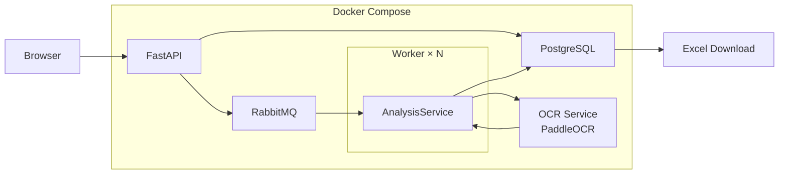

# 1 Сервис "Vitrage Analyzer" для анализа тендерных предложений по витражным конструкциям 

## 1.1 Описание сервиса
Vitrage Analyzer — веб-приложение для автоматического анализа тендерных предложений по витражным конструкциям. Система предназначена для ускорения подготовки тендерной документации за счёт автоматизации извлечения данных из строительных чертежей и расчёта общей площади конструкций. Это позволяет существенно сократить время обработки тендерного предложения, уменьшить количество ручных операций и снизить вероятность ошибок при подготовке коммерческих предложений.

В процессе анализа система определяет расположение витражных конструкций на чертежах, извлекает их основные параметры с использованием моделей компьютерного зрения и технологий оптического распознавания текста (OCR), сохраняет результаты в базе данных и формирует итоговую таблицу в формате Microsoft Excel.

Использование сервиса позволяет быстрее выполнять расчёты по крупным проектам и оперативно подготавливать тендерную документацию, что повышает скорость обработки входящих запросов и способствует более своевременной подаче коммерческих предложений. Это, в свою очередь, увеличивает вероятность участия в большем количестве тендеров и повышает конкурентоспособность компании.

## 1.2 Возможности

1) регистрация и авторизация пользователей;
2) загрузка тендерного предложения (файла с чертежами конструкций) в формате PDF;
3) выбор страниц документа, подлежащих анализу;
4) асинхронная обработка документов с использованием очереди сообщений RabbitMQ;
5) автоматическое обнаружение витражных конструкций на чертежах с помощью нейросетевой модели YOLO;
6) извлечение основных характеристик каждой конструкции:
- габаритных размеров;
- наименования;
- количества изделий;
- количества дверей;
7) распознавание текстовой информации с использованием отдельного OCR-сервиса на базе PaddleOCR;
8) сохранение результатов анализа в базе данных PostgreSQL;
9) экспорт результатов анализа в таблицу Microsoft Excel.

## 1.3 Архитектура

### 1.3.1 Схема

```mermaid
flowchart LR

Browser --> FastAPI

subgraph Docker["Docker Compose"]

    FastAPI

    RabbitMQ

    PostgreSQL

    OCR["OCR Service<br/>PaddleOCR"]

    subgraph Worker["Worker × N"]

        AnalysisService

    end

end

FastAPI --> RabbitMQ
FastAPI --> PostgreSQL

RabbitMQ --> AnalysisService

AnalysisService --> OCR
OCR --> AnalysisService

AnalysisService --> PostgreSQL

PostgreSQL --> Excel[Excel Download]
```

### 1.3.2 Описание
Приложение построено по сервисной архитектуре и состоит из нескольких независимых компонентов, взаимодействующих посредством очереди сообщений и HTTP-запросов.

Пользователь взаимодействует с веб-интерфейсом, реализованным на FastAPI. После загрузки документа информация о нём сохраняется в базе данных PostgreSQL, а задача анализа помещается в очередь RabbitMQ.

Фоновые процессы (Workers) получают задания из очереди и независимо выполняют обработку документов. Каждый воркер загружает модели компьютерного зрения только один раз при запуске, что позволяет эффективно использовать вычислительные ресурсы и масштабировать систему без изменения программного кода.

При необходимости распознавания текста воркер обращается к отдельному OCR-сервису по HTTP. OCR-сервис использует библиотеку PaddleOCR и выполняет распознавание текстовой информации, после чего возвращает результаты в формате JSON. Такое разделение позволяет независимо масштабировать OCR и основное приложение, а также исключает необходимость установки PaddleOCR на каждом воркере.

Результаты анализа сохраняются в PostgreSQL. Веб-приложение отображает их в виде единой таблицы и предоставляет возможность сформировать Excel-документ непосредственно на основе данных базы данных.

### 1.3.3

OCR-сервис может быть развернут двумя способами:

Если процессор поддерживает инструкции AVX, OCR-сервис может работать на том же компьютере, что и основное приложение, в составе общего Docker Compose.
Если процессор не поддерживает AVX, OCR-сервис рекомендуется развернуть на отдельном компьютере в локальной сети. В этом случае воркеры взаимодействуют с ним по HTTP, а архитектура приложения и программный код остаются неизменными.

# 2 Запуск сервиса

## 2.1 Системные требования
| Компонент                | Версия                                     |
| ------------------------ | ------------------------------------------ |
| Операционная система     | Windows 10/11 x64 или Linux x64            |
| Python                   | Не требуется (используется внутри Docker)  |
| Git                      | **2.40+**                                  |
| Docker Desktop           | **4.30+**                                  |
| Docker Compose           | **2.27+** (входит в состав Docker Desktop) |
| WSL                      | **2** (для Windows)                        |
| Процессор                | x86-64 с поддержкой **AVX**                |
| Оперативная память       | не менее **8 ГБ**     |
| Свободное место на диске | не менее **10 ГБ**                         |

## 2.2 Клонирование репозитория
```
git clone https://github.com/TimofeyKhramov/Vitrage_analyzer_MFDP.git
cd vitrage_analyzer_MFDP
```
### 2.3 Создание файла конфигурации

Создайте файл `.env` на основе шаблона `env.example`.

**Linux/macOS:**

```bash
cp .env.example .env
```

**Windows (PowerShell):**

```powershell
Copy-Item .env.example .env
```

**Windows (CMD):**

```cmd
copy .env.example .env
```

После создания файла `.env` при необходимости откройте его и укажите значения переменных окружения в соответствии с вашей конфигурацией.

Если значения переменных в env.example подходят для вашего окружения, достаточно просто скопировать файл без внесения изменений.

## 2.4 Запуск сервиса
Первый запуск (в зависимости от скорости интернет-соединения и производительности компьютера может занять несколько минут)
```bash
docker compose up --build
```

Повторные запуски
```bash
docker compose up -d
```

## 2.5 Переход на стартовую страницу сервиса после запуска
http://localhost:8000

## 2.6 Остановка сервиса

```bash
docker compose down
```

Для удаления контейнеров с томами данных
```bash
docker compose down -v
```

## 2.7 Тестовые файлы

Работу сервиса можно протестировать на файлах из папки test_folder.

Файл text_layer.pdf - страница с чертежами, где есть текстовый слой (извлечение с помощью библиотеки fitz для работы с PDF, более быстрый вариант для теста)

Файл no_text_layer.pdf - страница с чертежами, где нет текстового слоя (извлечение с помощью PaddleOCR)


