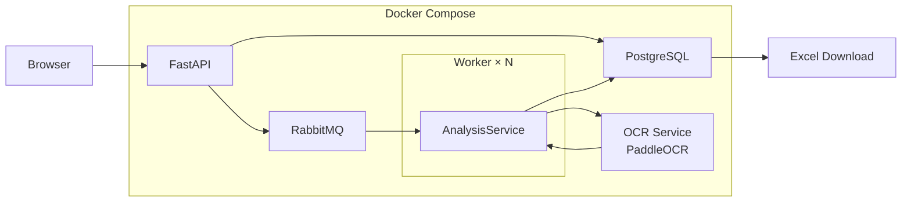

# 1 Сервис "Vitrage Analyzer" для анализа проектной документации по витражным конструкциям 

## 1.1 Описание сервиса
Vitrage Analyzer — веб-приложение для автоматического анализа проектной документации витражных конструкций. Система предназначена для ускорения подготовки тендерной документации за счёт автоматизации извлечения данных из строительных чертежей и расчёта общей площади конструкций. Это позволяет существенно сократить время обработки проектной документации, уменьшить количество ручных операций и снизить вероятность ошибок при подготовке коммерческих предложений.

В процессе анализа система определяет расположение витражных конструкций на чертежах, извлекает их основные параметры с использованием моделей компьютерного зрения и технологий оптического распознавания текста (OCR), сохраняет результаты в базе данных и формирует итоговую таблицу в формате Microsoft Excel.

Использование сервиса позволяет быстрее выполнять расчёты по крупным проектам и оперативно подготавливать тендерную документацию, что повышает скорость обработки входящих запросов и способствует более своевременной подаче коммерческих предложений. Это, в свою очередь, увеличивает вероятность участия в большем количестве тендеров и повышает конкурентоспособность компании.

## 1.2 Возможности

1) регистрация и авторизация пользователей;
2) загрузка проектной документации в формате PDF;
3) выбор страниц документа, подлежащих анализу;
4) асинхронная обработка документов с использованием очереди сообщений RabbitMQ;
5) автоматическое обнаружение витражных конструкций на чертежах с помощью нейросетевой модели YOLO;
6) извлечение основных характеристик каждой конструкции:
- габаритных размеров;
- наименования;
- количества изделий;
- количества дверей;
7) распознавание текстовой информации с использованием отдельного OCR-сервиса на базе PaddleOCR;
8) сохранение результатов анализа в базе данных PostgreSQL;
9) экспорт результатов анализа в таблицу Microsoft Excel.

## 1.3 Архитектура

### 1.3.1 Схема

```mermaid
flowchart LR

Browser --> FastAPI

subgraph Docker["Docker Compose"]

    FastAPI

    RabbitMQ

    PostgreSQL

    OCR["OCR Service<br/>PaddleOCR"]

    subgraph Worker["Worker × N"]

        AnalysisService

    end

end

FastAPI --> RabbitMQ
FastAPI --> PostgreSQL

RabbitMQ --> AnalysisService

AnalysisService --> OCR
OCR --> AnalysisService

AnalysisService --> PostgreSQL

PostgreSQL --> Excel[Excel Download]
```

### 1.3.2 Описание
Приложение построено по сервисной архитектуре и состоит из нескольких независимых компонентов, взаимодействующих посредством очереди сообщений и HTTP-запросов.

Пользователь взаимодействует с веб-интерфейсом, реализованным на FastAPI. После загрузки документа информация о нём сохраняется в базе данных PostgreSQL, а задача анализа помещается в очередь RabbitMQ.

Фоновые процессы (Workers) получают задания из очереди и независимо выполняют обработку документов. Каждый воркер загружает модели компьютерного зрения только один раз при запуске, что позволяет эффективно использовать вычислительные ресурсы и масштабировать систему без изменения программного кода.

При необходимости распознавания текста воркер обращается к отдельному OCR-сервису по HTTP. OCR-сервис использует библиотеку PaddleOCR и выполняет распознавание текстовой информации, после чего возвращает результаты в формате JSON. Такое разделение позволяет независимо масштабировать OCR и основное приложение, а также исключает необходимость установки PaddleOCR на каждом воркере.

Результаты анализа сохраняются в PostgreSQL. Веб-приложение отображает их в виде единой таблицы и предоставляет возможность сформировать Excel-документ непосредственно на основе данных базы данных.

### 1.3.3

OCR-сервис может быть развернут двумя способами:

Если процессор поддерживает инструкции AVX, OCR-сервис может работать на том же компьютере, что и основное приложение, в составе общего Docker Compose.
Если процессор не поддерживает AVX, OCR-сервис рекомендуется развернуть на отдельном компьютере в локальной сети. В этом случае воркеры взаимодействуют с ним по HTTP, а архитектура приложения и программный код остаются неизменными.

# 2 Запуск сервиса

## 2.1 Клонирование репозитория

```bash
git clone https://github.com/TimofeyKhramov/Vitrage_analyzer_MFDP.git
cd vitrage-analyzer
```

## 2.2 Создание файла окружения

Создайте файл `.env` на основе примера:

```bash
cp .env.example .env
```

При необходимости измените параметры подключения к базе данных, RabbitMQ и другим сервисам.

## 2.3 Запуск приложения

```bash
docker compose up --build
```

После запуска будут доступны:

- API — http://localhost:8000
- RabbitMQ Management — http://localhost:15672

## 2.4 Масштабирование обработки

Обработка документов полностью отделена от пользовательского интерфейса. Благодаря использованию RabbitMQ возможно запускать несколько экземпляров воркера одновременно. Очередь автоматически распределяет задания между свободными процессами, что позволяет увеличить производительность системы простым увеличением количества воркеров.

Например:

```bash
docker compose up --scale worker=4
```

В этом случае четыре независимых процесса будут параллельно получать задачи из общей очереди RabbitMQ. Распределение документов между воркерами происходит автоматически.

## 2.5 Остановка приложения

```bash
docker compose down
```

Для удаления контейнеров, сетей и томов:

```bash
docker compose down -v
```


